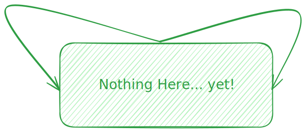

# Excalidraw Vscode Codespace Template

A quick template to selfhost excalidraw via live sharing or github codespace

## Quick Start

1. Fork template in github codespace
2. Install suggested extension (recommended via ./.vscode/extension.json)
3. Paint something...  
    
4. Share the codespace link to image(.svg or .png)

## Credit

Library icons from [Excalidraw Libraries](https://libraries.excalidraw.com/):

- GCP icons by @Clément Bosc
- AWS icons by @Anna Pastushko
